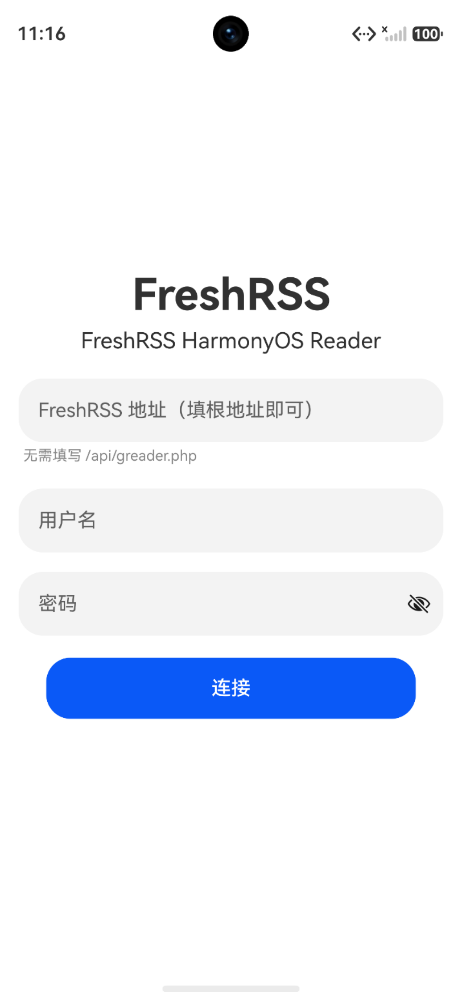
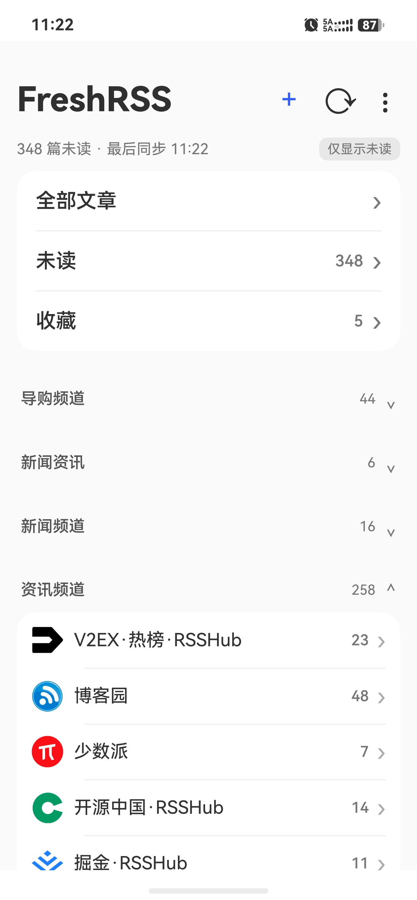

# FreshRSS for HarmonyOS

一个面向 HarmonyOS 的原生 FreshRSS 阅读客户端。

项目使用 FreshRSS 提供的 **Google Reader Compatible API** 与服务器通信，主要用于在 HarmonyOS 手机上获得更轻量、原生的 RSS 阅读体验。

本项目在部分 UI、文章列表以及阅读器交互设计上参考了开源项目 [Capy Reader](https://github.com/jocmp/capyreader)，并针对 HarmonyOS 与 FreshRSS 的使用场景进行了独立实现和适配。

> 当前项目以个人使用和稳定性为优先目标。
> 暂未上架 AppGallery，GitHub Releases 提供的是 **未签名 HAP 安装包**，需要使用者自行签名后侧载安装。

---

<p align="center">
  <strong>HarmonyOS Native · FreshRSS · Offline Reading · Unread Sync</strong>
</p>

<p align="center">
  <a href="#主要功能">主要功能</a> ·
  <a href="#应用截图">应用截图</a> ·
  <a href="#安装">安装</a> ·
  <a href="#freshrss-服务器要求">服务器要求</a> ·
  <a href="#致谢">致谢</a>
</p>

---

## 应用截图

建议将截图放在仓库根目录的 `assets/` 文件夹中，例如：

```text
assets/
├── home.png
├── article-list.png
└── reader.png
```

README 中可使用下面的布局：

<p align="center">
  
  
  
</p>

---

## 主要功能

### FreshRSS 账户

* 支持 FreshRSS 登录
* 自动登录
* 记住服务器地址和用户名
* 支持退出登录
* 退出时保留服务器地址和用户名
* FreshRSS 地址只需填写站点根地址
* 无需手动填写 `/api/greader.php`

### 首页与订阅

* FreshRSS 订阅列表
* 文件夹分组
* Feed 未读数
* 文件夹未读数
* 总未读数
* 收藏数量统计
* 文件夹展开 / 折叠
* 文件夹展开状态记忆
* 新增订阅
* 修改订阅标题
* 移动订阅
* 移动到“未分类”
* 取消订阅
* 文件夹改名
* 文件夹删除
* 本地未读数量即时联动

### 刷新策略

支持多种刷新方式：

* 仅手动刷新
* App 启动时刷新
* 进入 / 返回首页时仅刷新未读数量
* 仅在 Wi-Fi 下刷新

同时加入了轻量未读刷新和请求节流机制，减少不必要的 FreshRSS API 请求。

阅读文章、切换已读状态后，首页的：

* 总未读
* 文件夹未读
* Feed 未读

可以通过本地状态即时联动更新，无需每次返回首页都重新请求服务器。

### 文章列表

* 文章分页加载
* 仅显示未读 / 显示全部
* 真实未读数量显示
* 滑动切换已读 / 未读状态
* 收藏文章
* 批量标记已读
* 本地缓存
* 离线浏览
* 返回列表后已读状态即时更新
* 支持连续加载超过 50 篇文章

### 阅读器

* 正文阅读
* 上一篇 / 下一篇
* 横向滑动切换文章
* 自动标记已读
* 手动切换已读 / 未读
* 收藏文章
* 打开原文
* 连续分页阅读
* 阅读状态实时同步到文章列表和首页
* 短文章正文保持顶部对齐

### 图片查看

* 点击正文图片直接进入全屏
* 双指捏合缩放
* 支持约 `1x ~ 4x` 缩放
* 放大后单指拖动
* 单击图片关闭
* 点击黑色背景关闭
* 右上角关闭按钮
* 长按保存图片
* 复制图片链接

### 本地缓存与离线

* 首页缓存
* 文章列表缓存
* 离线启动
* 离线查看订阅
* 离线阅读已缓存文章
* 可配置文章缓存容量
* 支持 200 / 500 / 1000 篇缓存容量
* 14 天未使用缓存自动淘汰
* 超过容量后自动清理旧缓存
* 调小缓存容量后立即淘汰超出部分
* 缓存版本升级与旧缓存自动失效

---

## 设置

### 首页

* 文件夹展开方式
* 默认展开所有文件夹
* 记忆文件夹展开状态

### 刷新

* 仅手动刷新
* 启动时刷新
* 返回首页时仅刷新未读数量
* 仅在 Wi-Fi 下刷新

### 阅读

* 默认仅显示未读
* 未读标题加粗
* 文章排序
* 滚动时标记已读
* 标记全部已读前确认
* 保留已读文章

### 缓存

* 文章缓存容量
* 清除本地缓存

另外还包括：

* 外观设置
* 手势设置
* 账户设置
* 关于页面

---

## 技术信息

| 项目          | 信息                                    |
| ----------- | ------------------------------------- |
| 平台          | HarmonyOS                             |
| 开发方式        | HarmonyOS 原生应用                        |
| UI          | ArkUI                                 |
| 开发工具        | DevEco Studio                         |
| 数据源         | FreshRSS                              |
| API         | FreshRSS Google Reader Compatible API |
| Bundle Name | `com.freshrss.reader`                 |

---

## 安装

### 重要说明

GitHub Releases 中提供的是：

**未签名 HAP 安装包**

不能直接作为正式签名版本进行覆盖安装。

使用者需要：

1. 下载 Release 中的未签名 HAP
2. 使用自己的 HarmonyOS 签名材料进行签名
3. 将签名后的 HAP 侧载安装到设备

本项目目前不提供公开通用签名版本，也不会在仓库中提供开发者私有签名证书。

---

## 关于 HAP 签名

HarmonyOS 应用安装和升级会校验应用签名身份。

如果设备上已经安装过相同 Bundle Name 的版本，那么后续升级时需要保持相同的签名身份。

否则可能出现：

```text
install sign info inconsistent
```

例如：

```text
code:9568332
install sign info inconsistent
```

这意味着当前准备安装的 HAP 与设备中已有应用的签名身份不一致。

如果确定不需要保留旧版本数据，可以先卸载：

```bash
hdc shell bm uninstall -n com.freshrss.reader
```

然后重新安装自己签名后的 HAP。

> 注意：卸载应用会清除本地设置、登录状态和文章缓存。

如果计划长期使用，建议第一次安装时就固定一套自己的签名证书，并在之后的所有版本中继续使用同一套签名材料。

---

## 安全提示

请勿将以下私密签名材料上传到公开 GitHub 仓库：

* `.p12`
* `.cer`
* `.p7b`
* `.jks`
* 私钥
* 证书密码
* 签名密码
* Profile 中包含的私密信息
* 其他可用于冒充应用签名身份的文件

建议通过 `.gitignore` 排除本地签名目录和证书文件。

---

## FreshRSS 服务器要求

使用本客户端前，需要有一个已经正常部署并可访问的 FreshRSS 服务。

本项目通过 FreshRSS 的 **Google Reader Compatible API** 与服务器通信，因此 FreshRSS 服务端需要启用对应的 API 功能。

登录时服务器地址只需要填写 FreshRSS 根地址。

例如：

```text
https://rss.example.com
```

无需填写：

```text
/api/greader.php
```

客户端会自动处理对应 API 路径。

---

## 刷新机制

为了减少服务器请求并改善移动端体验，目前提供三种主要刷新模式。

### 仅手动

已有本地首页缓存时：

* 启动 App 不自动刷新
* 返回首页不请求未读接口
* 不执行完整刷新
* 只有手动点击刷新按钮时才访问 FreshRSS
* 阅读产生的未读变化通过本地状态即时更新

适合希望尽量减少服务器请求的用户。

### 启动时刷新

* App 首次进入首页时进行一次完整刷新
* 从文章列表或设置页返回首页时不再次完整刷新

### 进入 / 返回首页时仅刷新未读数量

已有本地缓存时：

* 只请求 FreshRSS 的未读统计
* 不重新请求完整订阅列表
* 不重新统计收藏
* 不执行完整首页同步

同时加入 5 秒请求节流：

* 短时间反复进入首页不会重复请求
* 已有请求进行中时不会并发再发第二次请求

---

## 未读数量同步

阅读状态成功写入 FreshRSS 后，本地会立即同步对应未读变化。

返回首页时可以立即更新：

* 总未读
* 对应 Feed 未读
* 对应文件夹未读

因此即使刷新模式设置为“仅手动”，阅读文章后也无需额外访问 FreshRSS 就可以看到未读数量变化。

支持的场景包括：

* 打开文章自动标记已读
* 正文中切换已读 / 未读
* 文章列表滑动切换已读 / 未读
* 滚动标记已读

---

## 真实未读数量

FreshRSS 文章接口采用分页返回。

例如第一页：

```text
n=50
```

即使某个 Feed 实际存在 54 篇未读文章，第一页也只能加载 50 篇。

因此本客户端不会使用当前已加载文章数量作为真实未读总数，而是结合 FreshRSS 未读统计显示真实数量。

例如：

```text
54 篇未读 · 最后刷新 09:48
```

同时仍然可以通过 continuation 继续加载剩余文章。

---

## 连续阅读

FreshRSS 的文章接口通常采用分页方式返回数据。

客户端会保存分页 continuation 信息，在当前页面文章读完之后继续向 FreshRSS 请求下一页。

因此即使第一页只有 50 篇文章，也可以继续阅读：

```text
第 51 篇
第 52 篇
第 53 篇
……
```

不会在第一页结束后中断。

连续分页是当前项目重点保持稳定的核心功能之一。

---

## 收藏数量

首页收藏数量通过 FreshRSS 的：

```text
stream/items/ids
```

接口统计：

```text
user/-/state/com.google/starred
```

并通过分页累计收藏条目数量。

收藏数量不会使用未读统计接口进行估算。

---

## 离线使用

客户端会优先使用本地缓存改善离线体验。

### 首页

无网络时：

* 优先读取本地首页缓存
* 显示已有订阅信息
* 避免先等待 HTTP 请求失败或超时

### 文章列表

如果相应列表已经缓存：

* 可以离线打开
* 可以查看已缓存文章
* 显示离线数据状态
* 滚动到底部时不会继续请求下一页

恢复网络后，可以通过手动刷新或当前刷新策略重新与 FreshRSS 同步。

---

## 网络错误提示

针对常见网络问题，客户端会尽量提供更明确的提示。

包括：

```text
请求超时，请检查网络或 FreshRSS 服务器
```

```text
无法解析 FreshRSS 服务器地址
```

```text
无法连接 FreshRSS 服务器
```

```text
HTTPS 证书或 TLS 连接失败
```

```text
FreshRSS 服务器暂时不可用
```

```text
FreshRSS 返回的数据异常
```

对于 `401 / 403` 等认证失效情况，会继续按照账户认证逻辑处理。

---

## 隐私说明

本应用不提供任何中转服务器。

FreshRSS 账户信息和 RSS 数据由客户端直接与用户自行配置的 FreshRSS 服务器通信。

建议不要在 GitHub Issues、截图、日志或其他公开位置泄露：

* FreshRSS 用户名
* 登录密码
* API Auth 信息
* Cookie
* Authorization Header
* 私有服务器地址
* 私有域名
* HTTPS 私有证书
* 应用签名证书
* 私钥及证书密码

---

## 当前项目定位

本项目目前主要面向个人使用。

开发优先级：

1. Bug 修复
2. 稳定性
3. 性能
4. FreshRSS API 兼容
5. HarmonyOS SDK 兼容
6. 小型 UI 优化

当前暂不计划重点开发：

* 全文搜索
* Tag 标签体系
* RSS 自动发现
* AppGallery 发布
* 复杂页面切换动画

整体方向：

> **稳定、轻量、自用体验优先。**

---

## 致谢

本项目在开发过程中参考和使用了以下优秀开源项目所提供的设计思路与基础能力。

### Capy Reader

[Capy Reader](https://github.com/jocmp/capyreader)

Capy Reader 是一个优秀的开源 RSS 阅读器。

本项目在部分界面布局、文章列表、阅读器交互以及整体阅读体验等方面参考了 Capy Reader 的设计思路，并结合 HarmonyOS 原生 ArkUI 与 FreshRSS 使用场景进行了独立实现和适配。

感谢 Capy Reader 项目及其开发者为开源 RSS 阅读器生态所做的贡献。

### FreshRSS

[FreshRSS](https://github.com/FreshRSS/FreshRSS)

感谢 FreshRSS 提供优秀的开源 RSS 服务以及 Google Reader Compatible API。

本客户端依赖 FreshRSS 提供的兼容 API，与用户自行部署的 FreshRSS 服务直接通信。

---

## 免责声明

本项目是一个独立开发的非官方第三方 FreshRSS 客户端。

本项目与：

* FreshRSS
* Capy Reader

均不存在官方隶属、合作或背书关系。

FreshRSS、Capy Reader 以及其他相关项目的名称、商标和版权归各自权利人所有。

本项目按现状提供。

使用者应自行确认：

* FreshRSS 服务器配置
* HarmonyOS 应用签名
* HAP 侧载安装方式
* 本地数据安全
* 服务器数据备份
* 自行签名证书的安全保存

因自行签名、侧载安装、服务器配置或数据操作产生的问题，需要使用者自行承担相应风险。

---

## License

项目许可证请以仓库中的 `LICENSE` 文件为准。

如果仓库尚未添加开源许可证，则默认不代表授予复制、修改、分发或再授权本项目源码的权利。

在添加正式开源许可证之前，如需复制、修改或重新分发项目代码，请先与项目维护者确认。
