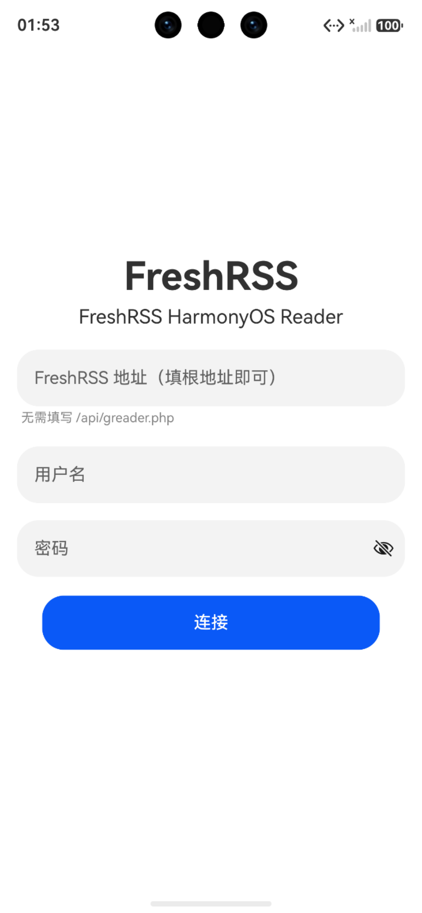
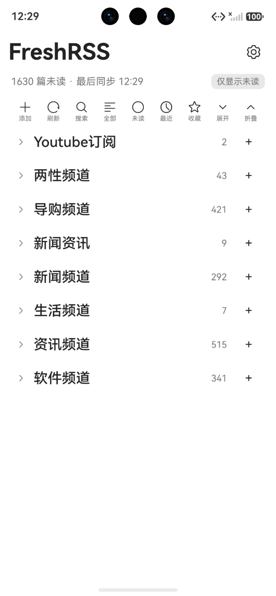
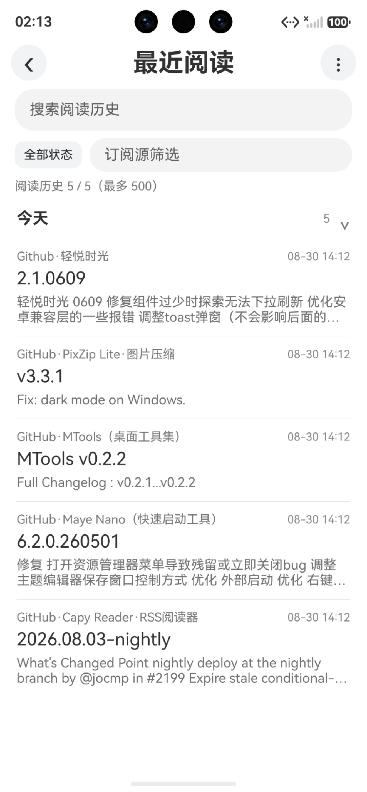
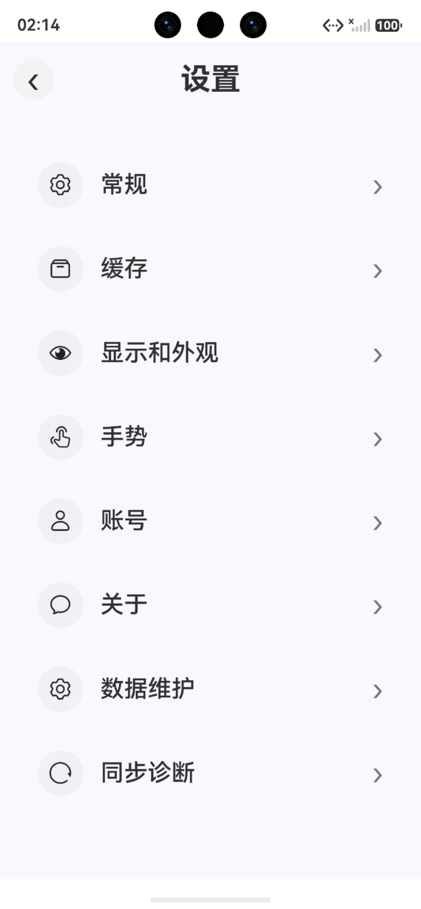
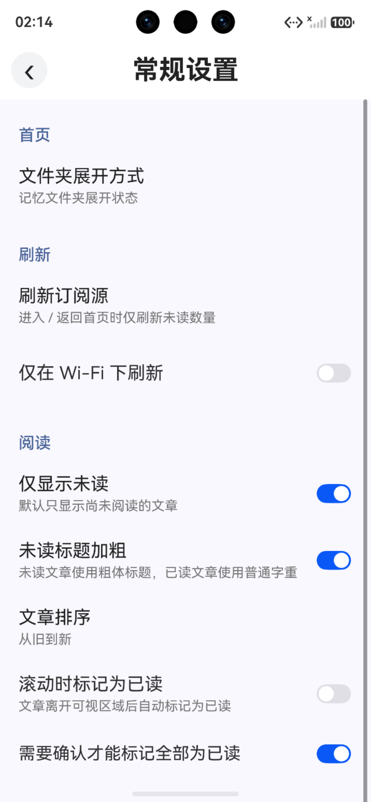
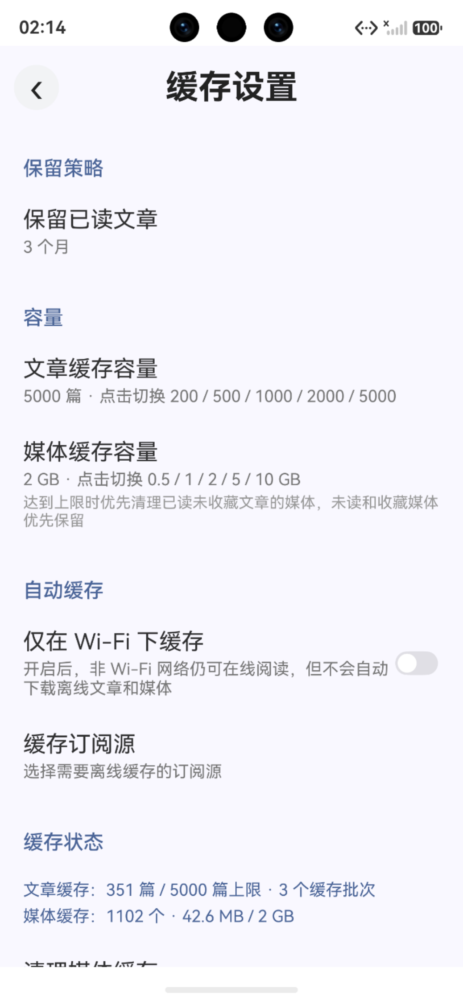
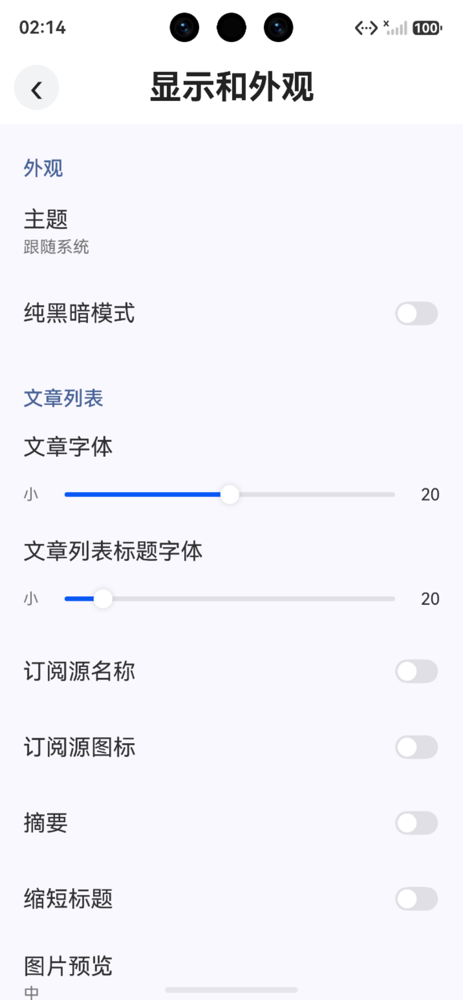
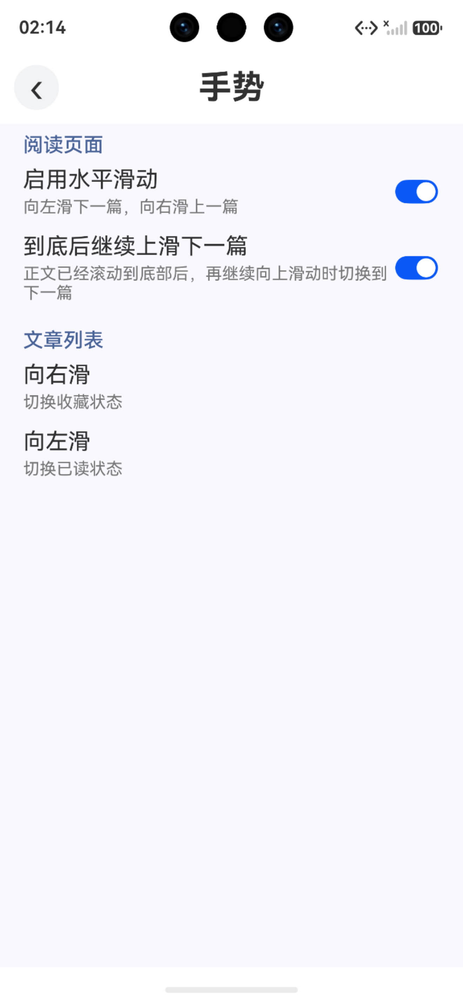
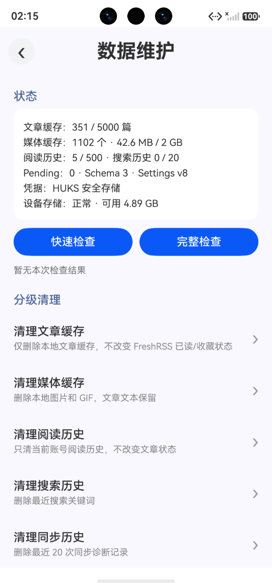
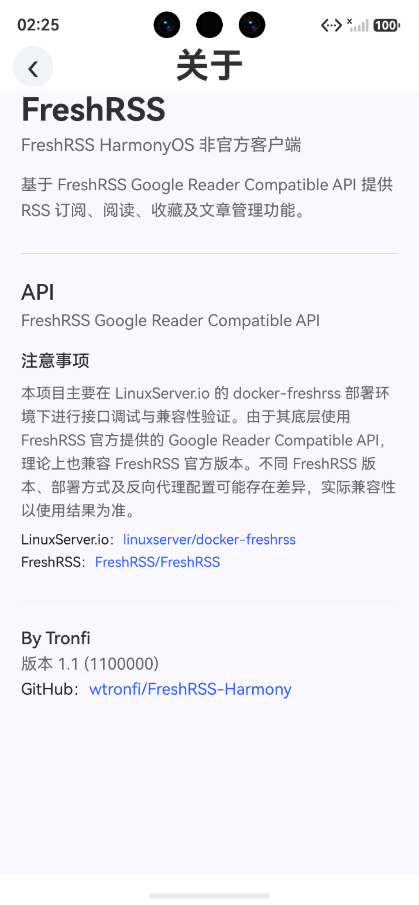

# FreshRSS Harmony

一个基于 **HarmonyOS** 的 FreshRSS 原生客户端。

面向自托管 FreshRSS 用户，提供更流畅、更稳定的移动端 RSS 阅读体验。

> **HarmonyOS Native · FreshRSS · Local First · Offline Reading**

---

## 📱 应用截图

### 

<p align="center">
  
  
  
</p>

### 

<p align="center">
  
  
  
</p>

### 

<p align="center">
  
  
  
</p>

### 

<p align="center">
  
  
  
</p>
---

## 项目简介

FreshRSS Harmony 是一个 HarmonyOS 原生 RSS 阅读应用。

应用通过 **FreshRSS Google Reader Compatible API** 连接用户自行部署的 FreshRSS 服务，在 HarmonyOS 设备上完成订阅浏览、文章阅读、状态同步、离线缓存等操作。

项目定位：

- 面向个人自托管 FreshRSS 用户
- 注重本地体验与数据控制
- 尽可能减少不必要的服务器请求
- 保持弱网和离线环境下的可用性
- 提供符合 HarmonyOS 使用习惯的原生阅读体验

适用于：

- 家庭 NAS 部署的 FreshRSS
- 私有服务器上的 FreshRSS
- 希望在 HarmonyOS 上使用原生 RSS 客户端的用户

> 本项目为独立开发的第三方 FreshRSS 客户端，不是 FreshRSS 官方客户端，也不隶属于 FreshRSS 官方项目。

---

## ✨ 主要功能

### FreshRSS 账户

- FreshRSS 服务连接
- 自动登录
- 记住服务器地址和用户名
- 支持退出登录
- FreshRSS 地址只需填写站点根地址
- 无需手动填写 `/api/greader.php`

### 首页与订阅

- Feed 订阅浏览
- 文件夹分组
- Feed / 文件夹 / 总未读数量
- 收藏数量统计
- 文件夹展开 / 折叠
- 文件夹展开状态记忆
- 新增订阅
- 修改订阅标题
- 移动订阅
- 移动到未分类
- 取消订阅
- 文件夹改名 / 删除
- 本地未读数量即时联动

### 文章列表

- 分页加载文章
- 连续加载超过 50 篇文章
- 仅显示未读 / 显示全部
- FreshRSS 真实未读数量
- 滑动切换已读 / 未读
- 收藏 / 取消收藏
- 批量标记已读
- 本地缓存
- 离线浏览
- 返回列表后状态即时更新

### 原生正文阅读器

正文使用 ArkUI 原生组件渲染，而不是把整个阅读页面简单交给 WebView。

目前支持：

- 正文阅读
- 标题与段落
- 正文图片
- 行内链接
- 粗体 / 斜体
- 无序列表 / 有序列表
- 引用
- 代码块
- 打开原文
- 上一篇 / 下一篇
- 横向滑动切换文章
- 自动标记已读
- 手动切换已读 / 未读
- 收藏文章
- 连续分页阅读
- 阅读进度保存与恢复
- FreshRSS 全文 CSS 抓取后的常见 HTML 内容

针对部分使用 FreshRSS **全文 CSS 选择器**获取正文的订阅源，也持续进行兼容性完善。

### 图片查看

- 点击正文图片进入全屏
- 双指捏合缩放
- 放大后单指拖动
- 点击关闭
- 长按保存图片
- 复制图片链接

### 本地缓存与离线

- 首页缓存
- 文章列表缓存
- 正文图片缓存
- 指定订阅源主动缓存
- 离线启动
- 离线查看订阅
- 离线阅读已缓存文章
- 网络失败时缓存降级
- 可配置文章缓存容量
- 自动淘汰长期未使用缓存
- 缓存容量控制
- 缓存版本升级与旧缓存失效处理
- 存储空间保护

### 离线操作同步

网络不可用时，已读和收藏操作会优先在本地生效：

```text
用户操作
↓
本地状态立即更新
↓
写入 Pending 队列
↓
等待网络恢复
↓
自动同步 FreshRSS
```

支持：

- 离线标记已读 / 未读
- 离线收藏 / 取消收藏
- Pending 操作队列
- 网络恢复自动补同步
- 本地状态与服务器状态合并

### 搜索与阅读管理

- 本地全局搜索
- 阅读历史
- 阅读进度
- 收藏文章管理

### 设置与维护

包括：

- 首页设置
- 刷新策略
- 阅读设置
- 外观设置
- 字号 / 行距
- 图片显示
- 手势设置
- 缓存设置
- 账户设置
- 关于页面
- 同步状态
- 同步诊断
- 日志记录与导出
- 数据健康检查
- 缓存 / Pending / 索引维护

---

## 🔄 刷新机制

为了减少不必要的 FreshRSS API 请求，目前支持多种刷新策略：

- 仅手动刷新
- App 启动时刷新
- 进入 / 返回首页时仅刷新未读数量
- 仅在 Wi-Fi 下刷新

同时加入轻量未读刷新和请求节流。

阅读文章或修改已读状态后：

```text
总未读
文件夹未读
Feed 未读
```

会优先通过本地状态即时联动，而不是每次返回首页都重新请求完整订阅数据。

---

## 📖 连续阅读

FreshRSS 文章接口通常采用分页返回。

客户端会保存 continuation 信息：

```text
第一页
↓
阅读到末尾
↓
继续请求下一页
↓
第 51 篇
第 52 篇
第 53 篇
……
```

因此不会因为单页接口返回数量限制而中断阅读。

---

## 🔧 使用要求

使用本应用需要：

1. 一个已经正常部署并可以访问的 FreshRSS 服务
2. FreshRSS 已启用 API
3. 拥有可以进行 API 登录的 FreshRSS 用户账号

FreshRSS 官方项目：

https://github.com/FreshRSS/FreshRSS

登录时服务器地址只需填写 FreshRSS 根地址，例如：

```text
https://rss.example.com
```

无需填写：

```text
/api/greader.php
```

客户端会自动处理对应 API 路径。

---

## 📦 下载与安装

请前往：

**https://github.com/wtronfi/FreshRSS-Harmony/releases**

下载对应版本的 HAP。

### 关于 HAP 签名

当前 GitHub Release 主要用于提供应用安装包。

- 无签名 HAP 不能直接作为普通正式安装包安装
- 需要使用自己的 HarmonyOS 签名环境重新签名

### 后续升级

HarmonyOS 应用升级会校验应用签名身份。

如果已经安装：

```text
com.freshrss.reader
```

后续版本建议继续使用同一套签名身份。

否则可能出现签名不一致而无法直接覆盖升级的情况。

如果必须卸载后重新安装，请注意：

> 卸载应用会同时清除本地设置、登录状态、文章缓存和其他应用本地数据。

---

## 🔐 隐私与安全

本应用不提供额外的 RSS 中转服务器。

FreshRSS 账户信息和 RSS 数据由客户端直接与用户自行配置的 FreshRSS 服务通信。

---

## 🔖 当前稳定版本

```text
FreshRSS Harmony 2.0

Version Name : 2.0
Version Code : 2026083001
Bundle Name  : com.freshrss.reader
```

2.0 作为当前稳定基准版本。

后续主要进行：

- Bug 修复
- 

## ❤️ 致谢

感谢：

- [FreshRSS](https://github.com/FreshRSS/FreshRSS) —— 提供优秀的自托管 RSS 服务及 API 能力
- [Capy Reader](https://github.com/jocmp/capyreader) —— 本项目部分 UI、文章列表和阅读交互设计曾参考其实现思路

本项目针对 HarmonyOS 与 FreshRSS 使用场景进行了独立实现和适配。

---

## 📄 仓库说明

当前仓库主要用于：

- 项目展示
- 应用截图
- 版本发布
- HAP 下载

**当前源码暂未公开。**
